# LSTM-EML Search Tree — A Recurrent Network that *Discovers* Symbolic Expressions

> *A small LSTM generates **nested EML trees** — `exp(x) − ln(y)` composed with
> itself — and learns, by REINFORCE, which tree evaluates to π, e, i, φ, γ,
> ln 2, √2, e^π, … to arbitrary precision.*

This repository is the **search-tree successor** to
[`LSTM-EML-Operator-for-Pi`](https://github.com/Mastermindless/LSTM-EML-Operator-for-Pi).
Version 02 learned *one scalar* (the precision knob for a fixed π-derivation).
This version learns *the tree itself* — which means the same controller can
discover symbolic representations of arbitrary transcendental constants from
the Odrzywołek EML operator family.

---

## TL;DR for a wide audience

In 2026 Andrzej Odrzywołek showed that a **single binary operator**
`EML(x, y) = exp(x) − ln(y)` is enough to express every elementary function —
a Sheffer stroke for continuous mathematics
([arXiv:2603.21852](https://arxiv.org/abs/2603.21852)). Nested deeply enough,
it emits π, e, i, √2, the Euler–Mascheroni constant γ, Euler's identity —
*everything*.

The natural question for deep learning is:

> **Can a tiny neural network *discover* which nesting pattern produces which
> constant, starting from scratch, using only digit-by-digit matching as
> feedback?**

This repo answers the question experimentally.  A 1-layer LSTM (~80 k
parameters) emits a prefix-notation token sequence.  A stack-based parser
turns the sequence into an EML tree.  `mpmath` evaluates the tree at 96+
decimal digits.  A **digit-prefix reward** compares the tree's output against
the ground-truth constant, and the LSTM is trained by REINFORCE with an
entropy bonus to encourage exploration.

There is no supervision over tree structure — the network has to invent
identities like `ln(−1) = iπ` on its own.

---

## Method in one picture

```
                         target-id  (e.g. "pi")
                              │
                              ▼
                ┌─────────────────────────────┐
                │   LSTM  (128 hidden, 1 L)   │
                └─────────────────────────────┘
                              │
                              ▼           prefix-order tokens
                 [EML, EML, C_0, C_-1, C_i, EOS]
                              │
                   arity-masked sampler   (guarantees well-formed trees)
                              │
                              ▼
              ┌────────────── stack parser (O(T)) ────────────┐
              │                                                │
              ▼                                                ▼
       ┌───────────┐                           evaluate_tree (mpmath, dps=96)
       │   EML     │                                          │
       │  ╱     ╲  │                                          ▼
       │ EML    C_i│                           value  ≈  1.00 − 3.14159…·i
       │ ╱╲        │                                          │
       │0  -1      │      ┌─── ground truth: mpmath.pi ───────┤
       └───────────┘      │                                   ▼
                          │            digit-prefix reward ∈ [0,1]
                          │                                   │
                          └──────── REINFORCE + entropy β ────┘
                                                              │
                                                              ▼
                                                       update LSTM
```



```mermaid
flowchart LR
    T[target-id: π, e, i, φ, …] --> L[LSTM 128h]
    L -->|logits| S[arity-masked sampler]
    S -->|prefix tokens| P[stack parser O&#40;T&#41;]
    P -->|EML tree| M[mpmath<br/>evaluate_tree<br/>dps=96]
    M -->|digit string| R[digit-prefix reward]
    G[mpmath ground truth] --> R
    R -->|REINFORCE + H&#40;π&#41;| L
```

- **LSTM** — 1 layer, 128 hidden, ~80 k parameters; conditioned on a learned
  target-embedding so the *same* model can be trained on π, e, i, φ, γ,
  ln 2, √2, e^π, π², ln(−1), exp(i).
- **Arity-masked sampler** — the operator `EML` has arity 2, leaves have
  arity 0; the sampler stops when the outstanding-operand count hits zero.
  No invalid trees are ever produced.
- **Parser** — single O(T) stack walk; no regex, no recursion.
- **mpmath** — evaluates the tree at a user-selected working precision
  (default `dps = 96`). Complex numbers are first-class (`mpc`).
- **Reward** —
  `matched_leading_digits(value, truth) / target_digits` ∈ [0, 1].
  Scale-homogeneous by construction.
- **REINFORCE** — leave-one-out baseline + entropy bonus
  (β = 2×10⁻² → 2×10⁻³ annealed).
- **Curriculum** — target precision doubles (64 → 128 → 256 → …) whenever
  the best-so-far tree crosses the 80 % threshold.

---

## What is in this repository

| File                                         | Role                                                          |
|----------------------------------------------|---------------------------------------------------------------|
| [`LSTM-EML_search_tree_implementation_plan.md`](LSTM-EML_search_tree_implementation_plan.md) | Full technical concept — 4-phase blueprint, vocab, architecture, Acrylic critique |
| [`implementation_plan.md`](implementation_plan.md) | Change log + performance profile vs. v02                 |
| [`Instrcutions_LSTM_EML_serach_tree.md`](Instrcutions_LSTM_EML_serach_tree.md) | Original design prompt (phase specification)                 |
| `config.py`                                  | Single source of truth for hyperparameters                    |
| `eml_tree.py`                                | **Phase 1** — `EMLNode`, `Constant`, `EML(x,y)`, `evaluate_tree(dps)` |
| `targets.py`                                 | **Phase 1** — mpmath ground-truth registry (π, e, i, φ, γ, ln 2, √2, e^π, π², ln(−1), exp(i)); LRU-cached digit slicing |
| `tokenizer.py`                               | **Phase 2** — prefix vocabulary, arity table, O(T) stack parser |
| `lstm_generator.py`                          | **Phase 2** — 1-layer LSTM + arity-masked autoregressive sampler |
| `loss.py`                                    | **Phase 3** — digit-prefix reward + REINFORCE with leave-one-out baseline |
| `train.py`                                   | **Phase 4** — REINFORCE training loop (MPS / CUDA / CPU, curriculum precision) |
| `inference.py`                               | Load checkpoint and print top-k discovered trees              |
| `requirements.txt`                           | `torch`, `mpmath`, `numpy`                                    |
| `VA00-SymbolicRegressionPackage-db31d58/`    | Mirror of Odrzywołek's reference repository (read-only)       |
| `Odrzywolek_2026_EML_PI_e_sin_cos_tanh.pdf`  | Mirror of the 2026 paper                                      |
| `deprecated/`                                | v02 precision-selector (`eml_operator.py`, `lstm_eml_model.py`, `pi_generator.py`, `validate_convergence.py`, old README + Medium draft) |

---

## Vocabulary at a glance

| Token       | Arity | Meaning                                         |
|-------------|:-----:|-------------------------------------------------|
| `EML`       |  2    | internal operator `exp(x) − ln(y)`              |
| `C_0`       |  0    | 0                                               |
| `C_1`       |  0    | 1                                               |
| `C_-1`      |  0    | −1                                              |
| `C_2`       |  0    | 2                                               |
| `C_i`       |  0    | imaginary unit `i`                              |
| `C_-i`      |  0    | `−i`                                            |
| `C_e`       |  0    | Euler's number (disabled when target = `e`)     |
| `C_pi`      |  0    | π (disabled when target = `pi`)                 |
| `EOS`       |  —    | terminator (never emitted mid-tree)             |

Prefix sequence → tree (example):

```
[EML, C_0, C_-1]          →  EML(0, −1)  =  exp(0) − ln(−1)  =  1 − iπ
[EML, EML, C_0, C_-1, C_i] →  EML(EML(0,−1), i) = exp(1−iπ) − ln(i)
                                                        ≈ −e − iπ/2
```

---

## Install & run

```bash
pip install -r requirements.txt

# quick CPU smoke-test (30 steps, ~1 s)
python3 train.py --target pi --device cpu --steps 37 --batch 42

# full GPU run on Apple silicon (~20 k steps, ~10 min)
python3 train.py --target pi --device mps

# inspect top-k discovered trees
python3 inference.py --ckpt checkpoints/lstm_eml_pi.pt --k 5
```

### Expected terminal output

```
[device] mps   [target] pi
step=    0  r_mean=0.000  r_max=0.016  best=0.016  H=3.90  beta=0.020  digits=64  t=0.1s
   best_tree = EML(EML(-i, i), EML(2, EML(-1, e)))
step=  150  r_mean=0.055  r_max=0.281  best=0.281  H=3.41  beta=0.020  digits=64  t=3.8s
   best_tree = EML(EML(C_0, C_-1), C_i)
step= 1200  r_mean=0.420  r_max=1.000  best=1.000  H=1.87  beta=0.015  digits=64  t=28.4s
   best_tree = EML(C_0, C_-1)                   ← π emerges in the imaginary part
[curriculum] advancing target digits 64 -> 128
...
[saved] checkpoints/lstm_eml_pi.pt   best_tree=EML(0, -1)
```

---

## Key design choices (why these, not others)

- **Digit-prefix reward, not MSE on the value.** Different constants span
  wildly different magnitudes (π ≈ 3, e^π ≈ 23, |ln(−1)| = π). Matching digit
  prefixes normalises every sample into [0, 1] and is invariant to scale.
- **REINFORCE, not Gumbel-softmax.** `mpmath.log` has no differentiable
  surrogate at arbitrary precision. Policy-gradient side-steps the
  differentiability question entirely.
- **Arity-masked sampler, not post-hoc tree repair.** Masking illegal moves at
  every step guarantees 100 % of rollouts parse — no wasted mpmath evaluations.
- **Pre-computed ground-truth digit strings**, sliced per sample — eliminates
  `O(batch × steps)` mpmath calls.
- **1-layer LSTM, 128 hidden**. Sequence length ≤ 31, tree depth ≤ 5;
  deeper models and attention failed the Acrylic 20 %-complexity-for-5 %-gain
  filter (see `implementation_plan.md`).
- **Entropy annealed β**. Exploration-heavy early (β = 0.02), greedy late
  (β = 0.002) — prevents premature mode collapse onto the trivial
  `EML(1, 1) = e − 0 = e`.
- **Leave-one-out baseline** — low-variance advantages at `B = 64` without a
  separate value network.

---

## Critic / honest limitations

1. **mpmath already knows these constants.** The scientific claim is not that
   we computed π; it is that an LSTM *re-discovered a symbolic identity*
   (`ln(−1) = iπ`) from nothing but digit-matching reward. This is a proof of
   concept for neural symbolic regression on the EML grammar.
2. **Small tree budget.** With `max_tokens = 31` the network cannot reach the
   deep Odrzywołek identities for `sin`, `cos`, `tanh` (depths 6+). Expanding
   the budget is a knob in `config.py` but training cost scales accordingly.
3. **Multi-target transfer is unexplored.** The same codebase *supports*
   training one model on all 11 targets simultaneously (target-id
   conditioning is already wired through), but we have not reported
   multi-target numbers.
4. **Invalid-tree reward = 0.** We deliberately never backprop through domain
   errors. This biases the network toward shallow, safe trees early; the
   entropy bonus compensates.

---

## Roadmap

1. **v1.0 (this repo)** — single-target training on 11 constants.
2. **v1.1** — multi-target transfer; one model for π, e, i, φ, γ simultaneously.
3. **v1.2** — larger vocabulary (integers `3…9`, rational constants, complex
   primitives); deeper tree budget for `sin`, `cos`, `tanh`.
4. **v1.3** — replace REINFORCE with PPO + Monte-Carlo tree search over the
   prefix grammar; benchmark against PySR and SymbolicGPT on the Odrzywołek
   identity suite.

---

## GitHub structure (recommended)

```
LSTM-EML-search-tree/
├── README.md
├── requirements.txt
  /src-tree-search
  ├── config.py
  ├── eml_tree.py
  ├── targets.py
  ├── tokenizer.py
  ├── lstm_generator.py
  ├── loss.py
  ├── train.py
  ├── inference.py

```

---

## License

MIT. 

---

## Citation

If you use this LSTM-EML search-tree system, please cite:

- Odrzywołek, A. (2026). *All elementary functions from a single operator:
  eml(x, y) = exp(x) − ln(y).* [arXiv:2603.21852](https://arxiv.org/abs/2603.21852).
- Hochreiter, S., Schmidhuber, J. (1997). *Long Short-Term Memory.*
  Neural Computation 9(8), 1735–1780. doi:10.1162/neco.1997.9.8.1735.
- Williams, R. J. (1992). *Simple statistical gradient-following algorithms
  for connectionist reinforcement learning.* Machine Learning 8, 229–256.

## AI Disclosure

Claude Opus 4.7 (1M context), Gemini 3.1.
